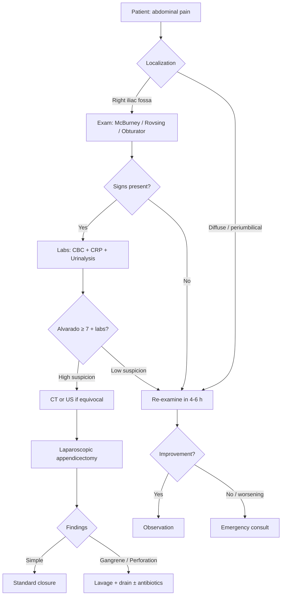

# Алгоритм: подозрение на аппендицит

## Пояснения

- При неясной картине допустимо динамическое наблюдение 4–6 часов с повторным осмотром.
- Гиперлейкозитоз + нейтрофилез повышают вероятность хирургической патологии.
